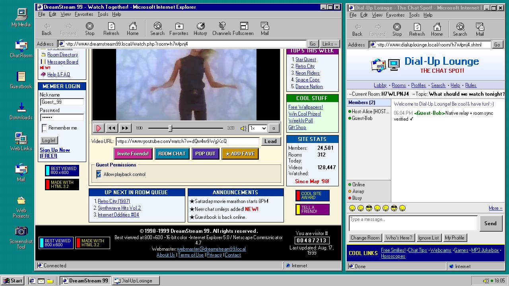
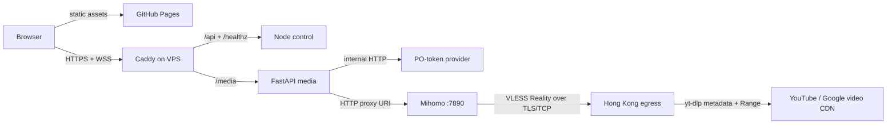

# DreamStream 99

[](https://github.com/ypnomania/DreamStream99/actions/workflows/pages.yml)
[](https://github.com/ypnomania/DreamStream99/actions/workflows/media-ci.yml)
[](LICENSE)

**Watch together, like it is 1999.** DreamStream 99 is a self-hosted YouTube watch party presented as a Windows 98 desktop. Its physical deployment has two nodes: GitHub Pages serves the static client, while one VPS owns room synchronization and relays progressive MP4 byte ranges without exposing Google CDN URLs.

一个真正可联机的复古观影房：GitHub Pages 承载纯静态前端，VPS 上的 Node.js、FastAPI 与 Caddy 负责房间同步、媒体解析和 Range 转发。

[Open DreamStream 99](https://ypnomania.github.io/DreamStream99/) · [Deployment guide](docs/DEPLOYMENT.md) · [Operations guide](docs/OPERATIONS.md) · [YouTube cookie guide](docs/YOUTUBE_COOKIES.md) · [Architecture notes](DESIGN_NOTES.md)



## What works

- Native HTML5 `<video>` playback; no YouTube IFrame API or embedded third-party player.
- Host-created rooms, guest invite links, member presence, chat, and synchronized load/play/pause/seek/rate commands.
- Stable `MediaRef` room state: `{ "provider": "youtube", "id": "…" }`. Expiring CDN URLs never enter the control protocol.
- Host and guest source fields show the same canonical YouTube URL reconstructed from `MediaRef`; resolve and buffer states remain visible until the native player is ready.
- One owner permission: `guestPlaybackControl`. Chat remains available to every joined member.
- Short-lived HMAC media grants, opaque relay capabilities, exact-origin checks, bounded stores, and control-plane rate limits.
- Same-media resolve singleflight, a bounded five-minute success cache, low-resource extraction concurrency, and terminable one-shot resolver subprocesses keep simultaneous host/guest joins fast and enforce the 45-second deadline.
- yt-dlp metadata resolution, progressive MP4 selection, HTTP `HEAD`/single-range relay, and one bounded automatic re-resolve after an upstream 403.
- Docker Compose deployment with non-root, read-only control and media containers; Caddy terminates TLS and exposes only the public gateway.
- Protected YouTube cookies, a pinned private Mihomo HTTP proxy backed by one Hong Kong VLESS Reality egress, an internal-only PO-token provider, and Node 22 EJS runtime for current YouTube challenges.

Production acceptance uses two WebSocket peers plus the three regression media
IDs `_5GDQOm1wvw`, `GIrBSG7RR1E`, and `9bQmwjT-1mw`; every public relay must
return `206 Partial Content`, a valid `Content-Range`, and 1024 bytes through the
same Hong Kong VLESS Reality egress. The real GitHub Pages client must also mount
the native player and advance playback without an iframe or media error.

## Architecture



| Plane | Deployment | Responsibility |
| --- | --- | --- |
| Frontend | GitHub Pages | Static Win98 UI, `WebSocketRoomClient`, `NativeMediaAdapter`, clock-offset and playback-anchor logic |
| Gateway | VPS Caddy | TLS, strict CORS, security headers, `/api`/`/media` routing, streaming flush |
| Control | VPS Node.js 22 | In-memory rooms, credentials, WebSocket v1 protocol, state broadcasts, 24-hour empty-room cleanup |
| Media | VPS Python 3.13 | Media-grant validation, bounded/cached yt-dlp resolution, opaque relay sessions, Range forwarding, 403 refresh |
| Media egress | VPS Mihomo | Keeps the application-facing HTTP proxy private and carries every media operation through one reviewed Hong Kong VLESS Reality node |

The application still uses only `http://media-egress:7890`. The non-root Mihomo
sidecar dials one reviewed VLESS Reality node from a dedicated Docker network
shared only with the media container. Its complete live configuration stays in the ignored
`deploy/secrets/egress/media-egress.yaml`; Compose publishes no proxy port and
the media container cannot read that file.

The default production endpoints are:

```text
Frontend:  https://ypnomania.github.io/DreamStream99/
Control:   https://dreamstream99.lucius7.dev/api/rooms
WebSocket: wss://dreamstream99.lucius7.dev/api/rooms/{roomId}/ws
Media:     https://dreamstream99.lucius7.dev/media
```

## Request flow

1. The host creates a room with `POST /api/rooms`; its owner token stays in the URL fragment, which is not sent in HTTP requests.
2. A copied invite omits that fragment. A guest exchanges a nickname at `POST /api/rooms/{roomId}/join` for a 12-hour room credential.
3. Both peers open the room WebSocket with subprotocols `dreamstream-v1` and `token.<credential>`. Every JSON frame carries `version: 1`.
4. Room state broadcasts only a `MediaRef`. Every peer reconstructs the same canonical YouTube URL for display, then requests a 120-second `mg1` grant and posts that grant plus the `MediaRef` to `/media/resolve`.
5. Requests for the same media share one in-flight yt-dlp extraction. Successful results enter a bounded short cache, while the UI reports resolve and buffer progress; a cold first load normally takes several seconds depending on YouTube and the configured egress.
6. FastAPI returns metadata and an opaque `/relay/{capability}` URL. The browser mounts it on the native player with `crossOrigin` set before `src`; neither the canonical display URL nor the response reveals the real Google CDN target.
7. If a relay origin expires with 403, concurrent requests share one refresh, the exact format is reselected, and the original Range is retried once. The browser can also obtain a new grant and capability after an expired or restarted session.

## Deploy on a VPS

Prerequisites: a Linux VPS, Docker Engine with Compose v2, a DNS record pointing a hostname at the VPS, and inbound TCP 80/443. Node and Python do not need to be installed on the host.

```bash
git clone https://github.com/ypnomania/DreamStream99.git
cd DreamStream99
cp deploy/.env.example .env
openssl rand -base64 48
```

Put the generated value in `.env` as `MEDIA_GRANT_SECRET`. Never commit or print
that file. Install the ignored single-node Mihomo VLESS Reality configuration as described in the
[deployment guide](docs/DEPLOYMENT.md), then set
`COMPOSE_FILE=docker-compose.yml:deploy/compose.media-egress.yml`,
`MEDIA_EGRESS_PROXY=http://media-egress:7890`, and the verified
`YTDLP_PLAYER_CLIENT=web_embedded` in the protected `.env`. For a fresh VPS where
Compose should own Caddy:

```bash
docker compose --profile bundled-gateway up -d --build
docker compose ps
```

If the host already runs Caddy, import [`deploy/Caddyfile.site`](deploy/Caddyfile.site)
from the host Caddyfile. Production uses the media-egress overlay after installing
the ignored `deploy/secrets/egress/media-egress.yaml` configuration:

```bash
COMPOSE_FILE=docker-compose.yml:deploy/compose.media-egress.yml \
  docker compose up -d --build control media pot-provider media-egress
```

The application ports bind to `127.0.0.1:8787` and `127.0.0.1:8788` by default. The PO-token sidecar has no host port. Follow the [deployment guide](docs/DEPLOYMENT.md) for DNS, Caddy validation, GitHub Pages settings, cookie fallback, upgrades, and rollback.

## Local development and tests

Node.js 22 or newer and Python 3.13 are the supported development versions.

```bash
npm ci
npm run verify
npm run build
```

The static build is written to `dist/`. With no endpoint variables it uses the local demo transport; the Pages workflow injects production WebSocket, API, and media URLs at build time. No server secret is written into the static artifact.

Run the media tests:

```bash
python3.13 -m venv media/.venv
media/.venv/bin/pip install --editable 'media[test]'
media/.venv/bin/pytest media
```

Run the public protocol and Range smoke check after deployment:

```bash
DREAMSTREAM_BASE_URL=https://dreamstream99.lucius7.dev npm run smoke:e2e
```

The smoke script creates a disposable room and never prints room credentials or media grants.

## Configuration

| Setting | Default | Purpose |
| --- | --- | --- |
| `MEDIA_GRANT_SECRET` | required | Exact shared HMAC secret for Node grant signing and Python verification |
| `ALLOWED_ORIGIN` | `https://ypnomania.github.io` | One exact browser origin; an Origin never includes the repository path |
| `PUBLIC_HOST` | `dreamstream99.lucius7.dev` | TLS hostname used by the bundled Caddy profile |
| `MAX_ROOMS` | `10000` | Bound on process-local control rooms |
| `YTDLP_COOKIEFILE_SOURCE` | empty | Optional read-only dedicated-account Netscape secret under `/run/secrets/` |
| `YTDLP_COOKIEFILE` | empty | Private tmpfs base copied into a disposable writable jar for each cache-miss yt-dlp extraction; enable with the source as documented in the [cookie guide](docs/YOUTUBE_COOKIES.md) |
| `YTDLP_PLAYER_CLIENT` | `default` | yt-dlp player client; production selects `web_embedded` after real cold-resolve and Range validation through the configured VLESS exit |
| `YTDLP_PO_TOKEN_PROVIDER` | internal bgutil endpoint | yt-dlp PO-token plugin extractor argument |
| `MEDIA_EGRESS_PROXY` | empty | One validated HTTP(S) proxy shared by resolution, relay, and refresh; overlay value is `http://media-egress:7890` |
| `YTDLP_PROXY` | empty | Deprecated compatibility alias; if both proxy variables are set, they must match exactly |
| `MEDIA_RESOLVE_CACHE_TTL_SECONDS` | `300` | Lifetime of successful server-side resolution results; failures are not cached |
| `MEDIA_RESOLVE_MAX_CACHE_ENTRIES` | `128` | LRU bound for successful resolution results |
| `MEDIA_RESOLVE_MAX_CONCURRENT` | `1` | Global yt-dlp extraction limit; keep `1` on a small VPS |
| `MEDIA_RESOLVE_MAX_PENDING` | `8` | Maximum distinct running or queued resolutions; overflow fails fast with `503` |
| `MEDIA_RESOLVE_TIMEOUT_SECONDS` | `45` | Hard deadline; the one-shot resolver subprocess is terminated on expiry |
| `RELAY_REFRESH_*` | see `.env.example` | Refresh deadline, failure cooldown, and global concurrency bound |

For a fork, change `ALLOWED_ORIGIN`, `PUBLIC_HOST`, and the three public endpoint variables in [`.github/workflows/pages.yml`](.github/workflows/pages.yml) together.

## Security and operational boundaries

- CORS rejects missing, duplicate, and foreign browser origins, but CORS is not authentication and does not stop non-browser traffic. Room credentials, short-lived media grants, opaque relay capabilities, firewall rules, and bandwidth monitoring remain necessary.
- Upstream URLs, yt-dlp raw output, cookies, request headers, and format IDs are never returned to the browser. Relay targets must be credential-free HTTPS `googlevideo.com` URLs and redirects are not followed.
- Rooms, guest credentials, messages, relay capabilities, and the short resolution cache are intentionally process-local. Restarting a container loses that service's volatile state; deploy one control replica and one Uvicorn worker.
- A relay capability has a 15-minute sliding idle lifetime. It authorizes byte access during that window, so do not log or share relay URLs.
- This architecture has no managed database, queue, transcoder, or control-plane subscription. The VPS, storage, DNS, and especially outbound media bandwidth can still cost money.
- A directly addressed VPS is discoverable and is not a DDoS shield. This project provides application authorization and strict exposure, not volumetric attack protection.
- YouTube behavior changes and some videos may require cookies, PO tokens, a supported JavaScript runtime, or different egress. Self-hosters are responsible for content rights and applicable platform terms.
- A YouTube cookie file is a live account credential. Use only a dedicated low-value account, keep the source `deploy/secrets/media/youtube.cookies.txt` owned by uid/gid `10001` with mode `0400`, and never commit, paste, or log it. The media container mounts only `deploy/secrets/media`; it cannot read the separately mounted Mihomo VLESS configuration. Startup stages a private `0600` tmpfs base; each actual cache-miss yt-dlp extraction gives its one-shot resolver subprocess a unique disposable writable copy, so extractor shutdown cannot alter the mounted secret or poison later requests. YouTube may invalidate login state when a workstation cookie is moved to a different VPS egress, so establish a new isolated session through the same exact VLESS public exit. Follow the [export, verification, rotation, and revocation procedure](docs/YOUTUBE_COOKIES.md).

Production media traffic must use the configured Hong Kong VLESS Reality egress consistently.
Cookie creation/export, yt-dlp resolution, relay byte reads, and 403 recovery must
all traverse the same configured Mihomo HTTP proxy and exact VLESS public exit; merely using
the same country is not sufficient. Validate the public relay with `Range:
bytes=0-1023` and require
`206 Partial Content` plus a valid `Content-Range` before declaring it ready.

See [operations](docs/OPERATIONS.md) for secret rotation, log hygiene, state-loss expectations, 403 diagnosis, and incident checks.

## Repository map

```text
public/                  GitHub Pages UI and browser adapters
server/                  Node control service and media-grant signer
media/                   FastAPI resolver and streaming relay
deploy/                  Caddy configs, env template, secret mount
deploy/compose.media-egress.yml  Private single-node Mihomo VLESS overlay
scripts/build-pages.js   Static Pages build with public runtime injection
scripts/smoke-e2e.mjs    Public control + media smoke test
tests/                   Node, frontend, and cross-language grant tests
docker-compose.yml       VPS application stack
```

## Protocol summary

| Endpoint / channel | Contract |
| --- | --- |
| `POST /api/rooms` | Create room → `{ roomId, hostToken }` |
| `POST /api/rooms/{id}/join` | Exchange nickname → `{ roomToken, clientId, expiresAt }` |
| `WS /api/rooms/{id}/ws` | v1 join, snapshot, playback, presence, permission, chat, ping |
| `POST /api/rooms/{id}/media-grants` | Joined credential → media-bound `mg1` grant |
| `POST /media/resolve` | Exact grant + `MediaRef` → metadata and opaque progressive relay URLs |
| `GET/HEAD /media/relay/{capability}` | Strict single-byte-range streaming; no transcoding |

The detailed state and recovery invariants live in [DESIGN_NOTES.md](DESIGN_NOTES.md).

## Credits and license

Project code is available under the [MIT License](LICENSE). Fonts, historical artwork, container images, and runtime dependencies may use different terms; see [THIRD_PARTY_NOTICES.md](THIRD_PARTY_NOTICES.md).
